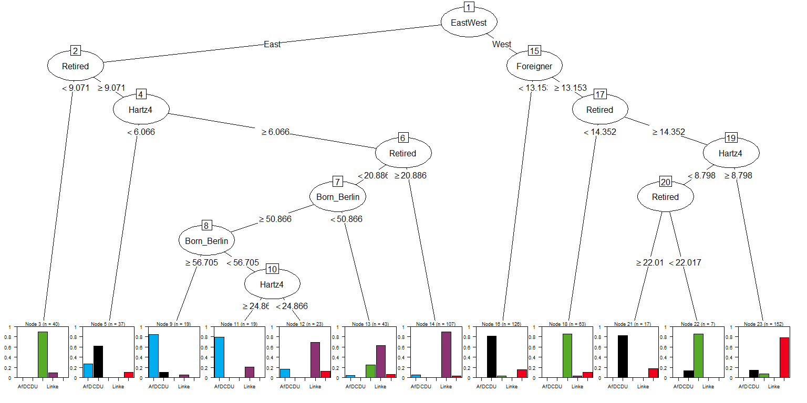

Berlin Election 2016
================

### Berlin Voter's Map

On 18th September 2016, Berlin voted for the state elections. Using the library "leaflet", the results of the state election is visualised according to the voting areas.

### How did Berlin vote?

Using the characteristics of voters in Berlin to plot the classification tree (rpart). This decision tree is firstly created using rpart, and then converted to a conditional inference tree using as.party function. <!-- -->

This shows that if a voting area is in East Berlin, and has less than 9.071% of Retiree, the Winner of that area is Gruene, with a likelihood is more than 80%. However, the tree seems rather overfitted. Let's prune the tree, by selecting a tree size that has the least cross-validated error ("xerror").

Credit: The <a href="http://interaktiv.morgenpost.de/wahlsieg-formel-berlin/" target="_blank">voting classification tree</a> and the <a href="http://berlinwahlkarte2016.morgenpost.de/" target="_blank">voting map</a> were inspired by the <a href="http://www.morgenpost.de/" target="_blank">Berliner Morgenpost</a>, along with the <a href="https://gist.github.com/berlinermorgenpost/f7c59ef94d21c7c942150b64d5e3ba4d" target="_blank">voting tree data</a> as well as the <a href="https://gist.github.com/berlinermorgenpost/f7b98db3f8a215f34e1e4bc1b4f5a363" target="_blank">sociodemographic data</a>.

Data source of Berlin vote results are found <a href="https://www.wahlen-berlin.de/home.asp" target="_blank">here</a>.

<a href="/berlin_map_tree_final_2opa_code.html">Click here for this page with the respective R code</a>.
